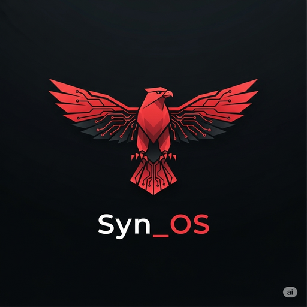

<div align="center">

# SynOS v1.0



### Revolutionary AI-Enhanced Cybersecurity Operating System

**Neural Dominance | Offensive Security | Professional MSSP Platform**

[](https://github.com/yourusername/synos/releases)
[](BUILD_V1.0_NOW.md)
[](LICENSE)
[](linux-distribution/)
[](docs/reference/security-tools.md)
[](src/ai-engine/)

[ Quick Start](#-quick-start) • [Download](#-download) • [Documentation](docs/README.md) • [Contributing](#-contributing) • [Community](#-community)

</div>

---

## What is SynOS?

**SynOS** is the world's first **AI-consciousness enhanced cybersecurity Linux distribution** that combines:

-    **Neural Darwinism AI** - Adaptive learning consciousness at the OS level
-   **500+ Security Tools** - ParrotOS + Kali + BlackArch + custom tools
-    **Offensive Security** - Professional red team & penetration testing platform
-    **MSSP Ready** - Enterprise-grade security consulting operations
-    **Educational** - Perfect for SNHU cybersecurity studies & training
-    **Custom Rust Kernel** - Bare-metal x86_64 with security focus

<details>
<summary><b> What Makes SynOS Different?</b></summary>

<br>

**Traditional Security Distros:**

-   Static tool collection
-   Manual workflow
-   No learning capability
-   Generic interface

**SynOS Red Phoenix:**

-   🧠 AI-enhanced tool selection
-   🤖 Automated threat correlation
-   📈 Learns from your patterns
-   🔴 Aggressive cyberpunk UI
-   🎵 Audio feedback system
-   📊 Real-time consciousness monitoring

</details>

---

##  Key Features

###  Revolutionary Red Phoenix Branding

-   Professional cyberpunk red/black aesthetic
-   Custom Plymouth boot theme
-   GRUB neural command menu
-   GTK3 dark red theme
-   Circuit pattern wallpapers
-   Tactical command center feel

###  AI Neural Darwinism Engine

-   Consciousness-aware scheduling
-   Pattern recognition & learning
-   Adaptive security responses
-   Educational insights & recommendations
-   Real-time threat intelligence
-   Automated playbook execution

###  Comprehensive Security Arsenal

-   **500+ Tools** from multiple distributions
-   Metasploit Framework
-   Burp Suite Professional
-   Wireshark & network analysis
-   John the Ripper & password tools
-   Nmap & reconnaissance suite
-   Custom SynOS security tools

###  Advanced Architecture

-   Custom Rust kernel (bare-metal x86_64)
-   XFCE desktop with AI integration
-   Neural network processing (TensorFlow Lite, ONNX)
-   SIEM integration (Splunk, Sentinel, QRadar)
-   Purple team automation (MITRE ATT&CK)
-   Container security (K8s, Docker hardening)

###  Educational Framework

-   Progress tracking & analytics
-   Safe sandboxed environments
-   Adaptive difficulty adjustment
-   Personalized learning paths
-   Comprehensive documentation
-   Tutorial system integration

---

##  Quick Start

### Prerequisites

-   **Host System:** Ubuntu/Debian Linux
-   **Disk Space:** 50GB+ available
-   **RAM:** 8GB minimum (16GB+ recommended)
-   **Tools:** `live-build`, `debootstrap`, `squashfs-tools`

### Build ISO from Source

```bash
# Clone repository
git clone https://github.com/yourusername/synos.git
cd synos

# Install dependencies
sudo apt update
sudo apt install live-build debootstrap squashfs-tools xorriso grub-pc-bin

# Build the ISO (30-60 minutes)
sudo ./scripts/02-build/core/build-synos-ultimate-iso.sh

# Output: build/synos-ultimate.iso (12-15GB)
```

### Test in QEMU

```bash
# BIOS mode
qemu-system-x86_64 -cdrom build/synos-ultimate.iso -m 4096 -smp 2

# UEFI mode
qemu-system-x86_64 -bios /usr/share/ovmf/OVMF.fd \
    -cdrom build/synos-ultimate.iso -m 4096
```

### Installation

1. **Burn to USB** (8GB+ required)

    ```bash
    sudo dd if=build/synos-ultimate.iso of=/dev/sdX bs=4M status=progress
    ```

2. **Boot from USB** - Select USB in BIOS/UEFI

3. **Login Credentials** (Live Session)

    - Username: `synos`
    - Password: `synos`
    - Root password: `toor`

4. **Install to Disk** - Run installer (if available) or use manually

📖 **Full Installation Guide:** [docs/01-getting-started/INSTALLATION.md](docs/01-getting-started/INSTALLATION.md)

---

##  Download

### Latest Release: v1.0.0 "Red Phoenix" (Coming Soon)

**ISO Images:**

-   [ ] **SynOS Ultimate** (12-15GB) - Full feature set
-   [ ] **SynOS Desktop** (8GB) - Desktop variant
-   [ ] **SynOS Red Team** (10GB) - Penetration testing focused

**Checksums & Signatures:**

-   [ ] SHA256SUMS
-   [ ] GPG Signature

🔗 **[Download from Releases](https://github.com/yourusername/synos/releases)**

> ⚠️ **Note:** Pre-built ISOs coming soon. For now, build from source (see above).

---

## 📖 Documentation

### Getting Started

-    [Quick Start Guide](docs/01-getting-started/QUICK_START.md)
-    [Installation Guide](docs/01-getting-started/INSTALLATION.md)
-    [VM Testing Guide](docs/02-user-guide/vm-testing.md)
-    [First Steps After Installation](docs/01-getting-started/FIRST_STEPS.md)

### User Guides

-    [Your First Security Scan](docs/02-user-guide/tutorials/first-security-scan.md)
-    [Using AI Features](docs/02-user-guide/tutorials/using-ai-features.md)
-    [Customizing Desktop](docs/02-user-guide/tutorials/customizing-desktop.md)
-    [Security Tools Reference](docs/02-user-guide/reference/security-tools.md)

### Developer Documentation

-    [Architecture Overview](docs/04-development/ARCHITECTURE.md)
-    [Building from Source](docs/03-build/ultimate-build-guide.md)
-    [Contributing Guide](CONTRIBUTING.md)
-    [AI Agent Reference](CLAUDE.md) (789 lines)

### Project Status

-   📊 [Current Status](docs/06-project-status/PROJECT_STATUS.md)
-   ✅ [TODO Roadmap](docs/06-project-status/TODO.md)
-   🔴 [Revolutionary Branding](docs/06-project-status/recent/2025-10-12-revolutionary-branding-complete.md)

---

##  Screenshots

> 📸 Coming soon! Screenshots of desktop, terminal, and boot sequence.

<!--


-->

---

## 🏗️ Architecture

```
SynOS v1.0 Architecture
┌─────────────────────────────────────────────────────────────┐
│                    User Applications                         │
│  (500+ Security Tools, GUI Apps, Custom Tools)              │
├─────────────────────────────────────────────────────────────┤
│                   Desktop Environment                        │
│  XFCE + Red Phoenix Theme + AI Integration                  │
├─────────────────────────────────────────────────────────────┤
│               AI Neural Darwinism Layer                      │
│  Consciousness Engine | Pattern Recognition | Learning       │
├─────────────────────────────────────────────────────────────┤
│                    Security Framework                        │
│  SIEM | Purple Team | Container Security | Threat Intel     │
├─────────────────────────────────────────────────────────────┤
│                  System Services                             │
│  AI Daemon | NATS Message Bus | Educational Framework       │
├─────────────────────────────────────────────────────────────┤
│                   Linux Kernel                               │
│  Debian 12 (6.5) + Custom Rust Kernel (x86_64)             │
└─────────────────────────────────────────────────────────────┘
```

**Key Components:**

-   **Rust Kernel:** Custom bare-metal kernel with security focus
-   **AI Engine:** Neural Darwinism consciousness system
-   **Security Tools:** 500+ from ParrotOS, Kali, BlackArch
-   **Desktop:** XFCE with red/black cyberpunk theme
-   **Build System:** Debian live-build with custom packages

📖 **Detailed Architecture:** [docs/04-development/ARCHITECTURE.md](docs/04-development/ARCHITECTURE.md)

---

## 🤝 Contributing

We welcome contributions from the community! Whether it's:

-   🐛 Bug reports
-   ✨ Feature requests
-   📖 Documentation improvements
-   🎨 Design enhancements
-   🔧 Code contributions

**Please see:** [CONTRIBUTING.md](CONTRIBUTING.md)

### Development Setup

```bash
# Clone repository
git clone https://github.com/yourusername/synos.git
cd synos

# Install Rust toolchain
rustup default nightly
rustup target add x86_64-unknown-none
rustup component add rust-src

# Install build tools
sudo apt install live-build debootstrap build-essential

# Read developer guide
cat docs/04-development/DEVELOPMENT_SETUP.md
```

---

##  License

This project is licensed under the **MIT License** - see the [LICENSE](LICENSE) file for details.

**Key Points:**

-   ✅ Free to use, modify, and distribute
-   ✅ Commercial use allowed
-   ✅ Attribution required
-   ❌ No warranty provided

---

## 🙏 Acknowledgments

SynOS wouldn't be possible without:

-   **[ParrotOS](https://www.parrotsec.org/)** - Security tool collection & inspiration
-   **[Kali Linux](https://www.kali.org/)** - Additional security tools
-   **[BlackArch](https://blackarch.org/)** - Extensive tool repository
-   **[Debian Project](https://www.debian.org/)** - Stable Linux foundation
-   **[Rust Community](https://www.rust-lang.org/)** - Amazing systems programming language

Special thanks to:

-   SNHU Cybersecurity Program
-   Open source security community
-   All contributors and testers

---

## 💬 Community

-   📧 **Email:** mogeem33@gmail.com
-   💬 **Discord:** [Join Server](https://discord.gg/syn_os) (Coming soon)
-   🐦 **Twitter:** [@SynOS_Official](https://twitter.com/syn_os) (Coming soon)
-   📝 **Blog:** [blog.synos.com](https://blog.syn_os.com) (Coming soon)

---

## 🗺️ Roadmap

### v1.0 "Red Phoenix" ✅ (Current)

-   [x] Revolutionary red/black branding
-   [x] 500+ security tools integration
-   [x] Neural Darwinism AI framework
-   [x] Custom Rust kernel
-   [x] Complete build system
-   [x] Audio boot enhancements

### v1.1 (Next - 1 month)

-   [ ] Complete icon theme
-   [ ] Enhanced Plymouth animations
-   [ ] Additional AI features
-   [ ] Performance optimizations
-   [ ] More tutorials

### v2.0 (Future - 3-6 months)

-   [ ] AI model updates
-   [ ] Advanced threat hunting
-   [ ] Cloud integration
-   [ ] Mobile companion app
-   [ ] Enterprise features

📖 **Full Roadmap:** [docs/05-planning/ROADMAP.md](docs/05-planning/ROADMAP.md)

---

## ⚠️ Security & Legal

**Educational & Professional Use Only**

SynOS is designed for:

-   ✅ Cybersecurity education and training
-   ✅ Authorized security assessments
-   ✅ Penetration testing with permission
-   ✅ Security research
-   ✅ Professional MSSP operations

❌ **Do NOT use for:**

-   Unauthorized access to systems
-   Illegal hacking activities
-   Malicious purposes

**You are responsible for ensuring you have proper authorization before using any security tools included in SynOS.**

🔒 **Security Policy:** [docs/08-security/SECURITY.md](docs/08-security/SECURITY.md)

---

## 📊 Project Stats

-   **Lines of Code:** 452,100+ (Rust, Shell, Python)
-   **Security Tools:** 500+
-   **Documentation:** 15+ comprehensive guides
-   **Assets:** 38 logo variants (9.4MB)
-   **Build Time:** 30-60 minutes
-   **ISO Size:** 12-15GB
-   **Development Time:** 6+ months

---

<div align="center">

###

**Built with a love of hacking by the SynOS team**

[⬆ Back to Top](#-synos-v10---red-phoenix)

---

_SynOS v1.0 - October 2025 - Neural Dominance Active_

</div>
