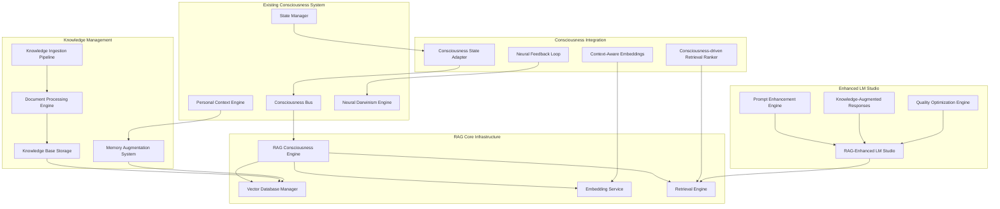
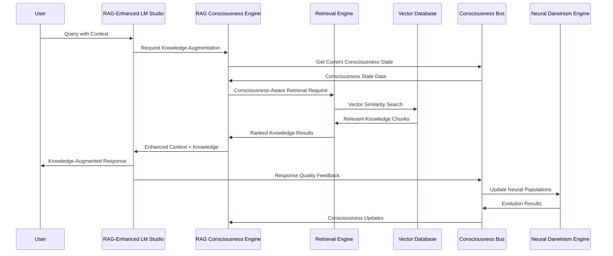
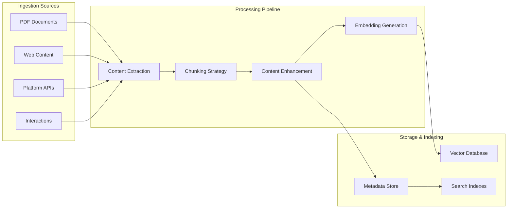
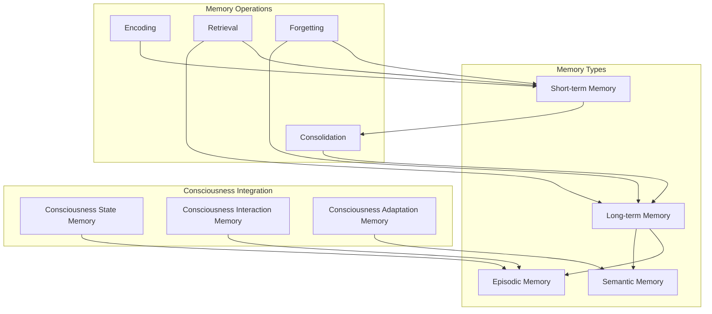

# Consciousness-Aware RAG System Architecture
## Comprehensive Retrieval-Augmented Generation for SynapticOS

### Table of Contents
1. [System Overview](#system-overview)
2. [RAG Architecture](#rag-architecture)
3. [Core Components](#core-components)
4. [Consciousness Integration](#consciousness-integration)
5. [Data Models](#data-models)
6. [Knowledge Management](#knowledge-management)
7. [Vector Database Design](#vector-database-design)
8. [Memory Augmentation](#memory-augmentation)
9. [Retrieval Strategies](#retrieval-strategies)
10. [Performance Optimization](#performance-optimization)
11. [Integration Patterns](#integration-patterns)
12. [Deployment Architecture](#deployment-architecture)

---

## System Overview

### Vision and Purpose

The Consciousness-Aware RAG System enhances the SynapticOS consciousness architecture with sophisticated knowledge retrieval and augmentation capabilities. This system provides:

- **Knowledge-Augmented Intelligence**: Enhance AI responses with relevant knowledge from multiple sources
- **Consciousness-Driven Retrieval**: Adapt retrieval strategies based on consciousness state and user context
- **Memory Augmentation**: Persistent memory for consciousness states, interactions, and learnings
- **Semantic Understanding**: Deep semantic search across documents, learning materials, and security content
- **Adaptive Learning**: Continuous improvement of retrieval accuracy through consciousness feedback

### Key Capabilities

**Consciousness-Aware Retrieval**
- Dynamic retrieval strategies based on consciousness level
- Context-sensitive knowledge selection
- Adaptive ranking algorithms influenced by neural population states
- Real-time consciousness feedback integration

**Multi-Modal Knowledge Management**
- Document ingestion and processing pipeline
- Learning materials and security content indexing
- Interaction history and consciousness state memory
- Cross-platform knowledge integration

**Advanced Vector Operations**
- High-dimensional embedding generation and storage
- Consciousness-influenced similarity calculations
- Hybrid search combining semantic and keyword matching
- Real-time vector updates and optimization

**Memory Systems Integration**
- Short-term consciousness state memory
- Long-term knowledge and interaction storage
- Episodic memory for learning sessions
- Semantic memory for domain knowledge

---

## RAG Architecture

### System Components Overview



### Data Flow Architecture



---

## Core Components

### 1. RAG Consciousness Engine

**Purpose**: Central orchestrator for consciousness-aware RAG operations

**Key Features**:
- Consciousness state integration and adaptation
- Dynamic retrieval strategy selection
- Knowledge relevance scoring with consciousness influence
- Real-time performance optimization
- Cross-component coordination

**API Interface**:
```python
class RAGConsciousnessEngine(ConsciousnessComponent):
    async def enhance_query(self, query: str, consciousness_state: ConsciousnessState) -> EnhancedQuery
    async def retrieve_knowledge(self, enhanced_query: EnhancedQuery) -> KnowledgeContext
    async def rank_results(self, results: List[KnowledgeChunk], context: RetrievalContext) -> List[RankedKnowledge]
    async def optimize_retrieval_strategy(self, feedback: RetrievalFeedback) -> bool
    async def get_consciousness_influence_metrics(self) -> Dict[str, float]
```

### 2. Vector Database Manager

**Purpose**: High-performance vector storage and similarity search

**Key Features**:
- Multi-collection vector storage (documents, interactions, consciousness states)
- Consciousness-influenced similarity metrics
- Real-time vector updates and indexing
- Hybrid search capabilities (semantic + keyword)
- Distributed scaling and replication

**API Interface**:
```python
class VectorDatabaseManager:
    async def store_embeddings(self, embeddings: List[EmbeddingDocument]) -> bool
    async def similarity_search(self, query_vector: np.ndarray, filters: Dict[str, Any]) -> List[SimilarityResult]
    async def consciousness_aware_search(self, query: ConsciousnessAwareQuery) -> List[ConsciousnessRankedResult]
    async def update_vector_weights(self, consciousness_feedback: ConsciousnessFeedback) -> bool
    async def get_collection_stats(self) -> Dict[str, CollectionStats]
```

### 3. Embedding Service

**Purpose**: Generate and manage high-quality embeddings with consciousness awareness

**Key Features**:
- Multiple embedding model support
- Consciousness-contextualized embeddings
- Batch processing and caching
- Model selection based on consciousness level
- Real-time embedding generation

**API Interface**:
```python
class ConsciousnessAwareEmbeddingService:
    async def generate_embeddings(self, texts: List[str], consciousness_context: Optional[ConsciousnessState]) -> List[np.ndarray]
    async def generate_consciousness_contextualized_embedding(self, text: str, consciousness_state: ConsciousnessState) -> np.ndarray
    async def batch_embed_documents(self, documents: List[Document]) -> List[EmbeddingDocument]
    async def update_embedding_model(self, model_config: EmbeddingModelConfig) -> bool
    async def get_embedding_quality_metrics(self) -> EmbeddingMetrics
```

### 4. Knowledge Ingestion Pipeline

**Purpose**: Automated knowledge acquisition and processing

**Key Features**:
- Multi-format document processing (PDF, DOCX, HTML, Markdown)
- Learning platform integration (TryHackMe, HackTheBox, etc.)
- Security content aggregation
- Consciousness interaction logging
- Real-time knowledge updates

**API Interface**:
```python
class KnowledgeIngestionPipeline:
    async def ingest_document(self, document_path: str, metadata: DocumentMetadata) -> IngestionResult
    async def ingest_learning_platform_content(self, platform: str, content_filter: ContentFilter) -> IngestionResult
    async def ingest_consciousness_interactions(self, interaction_batch: List[ConsciousnessInteraction]) -> bool
    async def schedule_periodic_ingestion(self, source_config: SourceConfiguration) -> str
    async def get_ingestion_status(self) -> IngestionStatus
```

### 5. Memory Augmentation System

**Purpose**: Persistent memory for consciousness states and interactions

**Key Features**:
- Episodic memory for learning sessions
- Semantic memory for domain knowledge
- Consciousness state history tracking
- User interaction pattern storage
- Memory consolidation and optimization

**API Interface**:
```python
class MemoryAugmentationSystem:
    async def store_consciousness_episode(self, episode: ConsciousnessEpisode) -> str
    async def retrieve_similar_episodes(self, current_state: ConsciousnessState) -> List[ConsciousnessEpisode]
    async def consolidate_memory(self, consolidation_criteria: ConsolidationCriteria) -> ConsolidationResult
    async def get_memory_insights(self, user_id: str) -> MemoryInsights
    async def optimize_memory_storage(self) -> OptimizationResult
```

---

## Consciousness Integration

### Consciousness-Driven Retrieval Strategies

The RAG system adapts its retrieval behavior based on consciousness state:

**Low Consciousness (0.0 - 0.3)**:
- Focus on basic, foundational knowledge
- Prefer simple, clear explanations
- Reduce cognitive load in retrieved content
- Emphasize step-by-step guidance

**Moderate Consciousness (0.3 - 0.6)**:
- Balance between basic and advanced concepts
- Include contextual examples
- Moderate complexity in retrieved knowledge
- Support exploratory learning

**High Consciousness (0.6 - 0.8)**:
- Retrieve advanced, nuanced information
- Include multiple perspectives and approaches
- Support complex reasoning and analysis
- Encourage creative problem-solving

**Peak Consciousness (0.8 - 1.0)**:
- Access cutting-edge knowledge and research
- Retrieve interdisciplinary connections
- Support innovative thinking and synthesis
- Enable expert-level discourse

### Neural Population Influence

Different neural populations influence retrieval strategies:

```python
class ConsciousnessInfluencedRetrieval:
    def calculate_retrieval_weights(self, consciousness_state: ConsciousnessState) -> RetrievalWeights:
        weights = RetrievalWeights()
        
        # Executive population influences complexity and depth
        if 'executive' in consciousness_state.neural_populations:
            executive_fitness = consciousness_state.neural_populations['executive'].fitness_average
            weights.complexity_preference = executive_fitness
            weights.depth_preference = executive_fitness * 1.2
        
        # Memory population influences historical context retrieval
        if 'memory' in consciousness_state.neural_populations:
            memory_fitness = consciousness_state.neural_populations['memory'].fitness_average
            weights.historical_context_weight = memory_fitness
            weights.pattern_matching_weight = memory_fitness * 1.1
        
        # Sensory population influences multimodal content preference
        if 'sensory' in consciousness_state.neural_populations:
            sensory_fitness = consciousness_state.neural_populations['sensory'].fitness_average
            weights.multimodal_preference = sensory_fitness
            weights.visual_content_weight = sensory_fitness * 0.8
        
        return weights
```

---

## Data Models

### Core RAG Data Structures

```python
@dataclass
class KnowledgeChunk:
    """Individual knowledge piece with metadata"""
    chunk_id: str
    content: str
    embedding: np.ndarray
    source_document: str
    chunk_type: str  # 'document', 'interaction', 'consciousness_state'
    metadata: Dict[str, Any]
    consciousness_relevance: float
    quality_score: float
    created_at: datetime
    last_accessed: datetime

@dataclass
class ConsciousnessAwareQuery:
    """Enhanced query with consciousness context"""
    query_id: str
    original_query: str
    enhanced_query: str
    consciousness_state: ConsciousnessState
    user_context: Optional[UserContextState]
    retrieval_preferences: RetrievalPreferences
    expected_response_type: str
    priority: int

@dataclass
class RetrievalContext:
    """Context for retrieval operations"""
    consciousness_level: float
    neural_population_states: Dict[str, float]
    user_skill_levels: Dict[str, SkillLevel]
    current_learning_session: Optional[str]
    recent_interactions: List[str]
    domain_focus: List[str]
    complexity_preference: float

@dataclass
class KnowledgeContext:
    """Retrieved knowledge with consciousness influence"""
    context_id: str
    retrieved_chunks: List[RankedKnowledge]
    consciousness_influence_score: float
    retrieval_confidence: float
    knowledge_coverage: Dict[str, float]
    source_diversity: float
    relevance_scores: List[float]
    retrieval_metadata: Dict[str, Any]

@dataclass
class RankedKnowledge:
    """Knowledge chunk with consciousness-influenced ranking"""
    knowledge_chunk: KnowledgeChunk
    relevance_score: float
    consciousness_alignment: float
    user_context_match: float
    recency_score: float
    authority_score: float
    final_rank_score: float
    ranking_explanation: str

@dataclass
class ConsciousnessEpisode:
    """Episodic memory of consciousness interactions"""
    episode_id: str
    user_id: str
    session_id: str
    start_time: datetime
    end_time: datetime
    consciousness_trajectory: List[Tuple[datetime, float]]
    interactions: List[ConsciousnessInteraction]
    knowledge_accessed: List[str]
    learning_outcomes: List[str]
    episode_summary: str
    embedding: np.ndarray

@dataclass
class EmbeddingDocument:
    """Document with embeddings and metadata"""
    document_id: str
    content: str
    embedding: np.ndarray
    document_type: str
    source: str
    metadata: Dict[str, Any]
    consciousness_tags: List[str]
    quality_metrics: Dict[str, float]
    access_patterns: Dict[str, int]
    last_updated: datetime
```

### Vector Database Schema

```python
class VectorCollections:
    """Vector database collection definitions"""
    
    DOCUMENTS = "documents"           # Learning materials, security content
    INTERACTIONS = "interactions"     # User-consciousness interactions
    CONSCIOUSNESS_STATES = "consciousness_states"  # Historical consciousness data
    EPISODIC_MEMORY = "episodic_memory"  # Learning session episodes
    SEMANTIC_MEMORY = "semantic_memory"  # Domain knowledge concepts
    
    COLLECTION_SCHEMAS = {
        DOCUMENTS: {
            "vector_dimension": 1536,  # OpenAI ada-002 dimension
            "index_type": "HNSW",
            "distance_metric": "cosine",
            "metadata_fields": [
                "document_type", "source", "domain", "difficulty_level",
                "consciousness_relevance", "quality_score", "created_at"
            ]
        },
        INTERACTIONS: {
            "vector_dimension": 1536,
            "index_type": "IVF_FLAT",
            "distance_metric": "inner_product",
            "metadata_fields": [
                "user_id", "session_id", "consciousness_level", "interaction_type",
                "success_rate", "timestamp"
            ]
        },
        CONSCIOUSNESS_STATES: {
            "vector_dimension": 768,   # Specialized consciousness embedding
            "index_type": "HNSW",
            "distance_metric": "cosine",
            "metadata_fields": [
                "consciousness_level", "emergence_strength", "neural_populations",
                "user_id", "timestamp", "context_type"
            ]
        }
    }
```

---

## Knowledge Management

### Document Processing Pipeline



### Chunking Strategies

**Consciousness-Aware Chunking**:
- Adaptive chunk sizes based on consciousness level
- Semantic boundary detection
- Overlap optimization for context preservation
- Domain-specific chunking rules

```python
class ConsciousnessAwareChunker:
    def chunk_document(self, document: Document, consciousness_context: Optional[ConsciousnessState]) -> List[DocumentChunk]:
        # Determine optimal chunk size based on consciousness level
        if consciousness_context:
            base_chunk_size = self._calculate_optimal_chunk_size(consciousness_context.consciousness_level)
        else:
            base_chunk_size = 512  # Default
        
        # Apply domain-specific adjustments
        domain_multiplier = self._get_domain_complexity_multiplier(document.domain)
        chunk_size = int(base_chunk_size * domain_multiplier)
        
        # Perform semantic chunking
        chunks = self._semantic_chunk(document.content, chunk_size)
        
        # Add consciousness-relevant metadata
        for chunk in chunks:
            chunk.consciousness_relevance = self._calculate_consciousness_relevance(
                chunk.content, consciousness_context
            )
        
        return chunks
```

### Content Enhancement

**Consciousness-Driven Enhancement**:
- Automatic tagging with consciousness relevance
- Difficulty level assessment
- Learning objective extraction
- Cross-reference generation

```python
class ContentEnhancer:
    async def enhance_content(self, content: str, source_metadata: Dict[str, Any]) -> EnhancedContent:
        enhanced = EnhancedContent(original_content=content)
        
        # Extract learning objectives
        enhanced.learning_objectives = await self._extract_learning_objectives(content)
        
        # Assess difficulty and consciousness requirements
        enhanced.difficulty_assessment = await self._assess_difficulty(content)
        enhanced.consciousness_requirements = await self._assess_consciousness_requirements(content)
        
        # Generate consciousness-relevant tags
        enhanced.consciousness_tags = await self._generate_consciousness_tags(content)
        
        # Create cross-references
        enhanced.cross_references = await self._find_cross_references(content)
        
        return enhanced
```

---

## Vector Database Design

### Database Architecture

**Multi-Collection Design**:
- Separate collections for different data types
- Optimized indexing strategies per collection
- Cross-collection relationship mapping
- Efficient similarity search algorithms

**Consciousness-Influenced Similarity**:
```python
class ConsciousnessAwareSimilarity:
    def calculate_similarity(self, 
                           query_vector: np.ndarray,
                           candidate_vector: np.ndarray,
                           consciousness_context: ConsciousnessState) -> float:
        
        # Base cosine similarity
        base_similarity = cosine_similarity(query_vector, candidate_vector)
        
        # Consciousness influence factors
        consciousness_boost = self._calculate_consciousness_boost(consciousness_context)
        complexity_alignment = self._assess_complexity_alignment(consciousness_context)
        
        # Combined similarity score
        final_similarity = (
            base_similarity * 0.7 +
            consciousness_boost * 0.2 +
            complexity_alignment * 0.1
        )
        
        return final_similarity
```

### Vector Database Implementation Options

**Primary Recommendation: Qdrant**
- High-performance vector similarity search
- Advanced filtering capabilities
- Horizontal scaling support
- Python-native integration
- Consciousness metadata support

**Alternative Options**:
- **Chroma**: Lightweight, easy deployment
- **Weaviate**: GraphQL API, advanced features
- **Milvus**: Enterprise-scale, distributed
- **FAISS**: High-performance, research-grade

### Database Configuration

```yaml
vector_database:
  provider: "qdrant"
  host: "localhost"
  port: 6333
  
  collections:
    documents:
      vector_size: 1536
      distance: "Cosine"
      hnsw_config:
        m: 16
        ef_construct: 200
      
    interactions:
      vector_size: 1536
      distance: "Dot"
      quantization:
        type: "scalar"
        quantile: 0.99
      
    consciousness_states:
      vector_size: 768
      distance: "Cosine"
      payload_index:
        consciousness_level: "float"
        user_id: "keyword"
        timestamp: "datetime"
```

---

## Memory Augmentation

### Memory System Architecture



### Memory Consolidation Process

```python
class MemoryConsolidationEngine:
    async def consolidate_consciousness_session(self, session: ConsciousnessSession) -> ConsolidationResult:
        """Consolidate consciousness session into long-term memory"""
        
        # Extract key moments and patterns
        key_moments = await self._extract_key_moments(session)
        learning_patterns = await self._identify_learning_patterns(session)
        consciousness_insights = await self._extract_consciousness_insights(session)
        
        # Create episodic memory
        episode = ConsciousnessEpisode(
            episode_id=str(uuid.uuid4()),
            user_id=session.user_id,
            session_id=session.session_id,
            start_time=session.start_time,
            end_time=session.end_time,
            consciousness_trajectory=session.consciousness_trajectory,
            interactions=session.interactions,
            knowledge_accessed=session.knowledge_accessed,
            learning_outcomes=session.learning_outcomes,
            episode_summary=await self._generate_episode_summary(session)
        )
        
        # Generate episode embedding
        episode.embedding = await self._generate_episode_embedding(episode)
        
        # Store in vector database
        await self.vector_db.store_episode(episode)
        
        # Update semantic memory
        await self._update_semantic_memory(learning_patterns, consciousness_insights)
        
        return ConsolidationResult(
            episode_id=episode.episode_id,
            consolidation_quality=await self._assess_consolidation_quality(episode),
            memory_connections=await self._find_memory_connections(episode)
        )
```

### Memory Retrieval Strategies

**Context-Aware Retrieval**:
```python
class MemoryRetrievalEngine:
    async def retrieve_relevant_memories(self, 
                                       current_context: ConsciousnessState,
                                       query: str,
                                       user_id: str) -> List[RelevantMemory]:
        
        # Generate query embedding with consciousness context
        query_embedding = await self.embedding_service.generate_consciousness_contextualized_embedding(
            query, current_context
        )
        
        # Search episodic memory
        episodic_results = await self.vector_db.similarity_search(
            collection="episodic_memory",
            query_vector=query_embedding,
            filters={"user_id": user_id},
            limit=10
        )
        
        # Search semantic memory
        semantic_results = await self.vector_db.similarity_search(
            collection="semantic_memory",
            query_vector=query_embedding,
            limit=5
        )
        
        # Rank and combine results
        relevant_memories = await self._rank_memory_relevance(
            episodic_results + semantic_results,
            current_context,
            query
        )
        
        return relevant_memories
```

---

## Retrieval Strategies

### Consciousness-Driven Retrieval Pipeline

```python
class ConsciousnessAwareRetrievalEngine:
    async def retrieve_knowledge(self, query: ConsciousnessAwareQuery) -> KnowledgeContext:
        """Main retrieval pipeline with consciousness awareness"""
        
        # Stage 1: Query Enhancement
        enhanced_query = await self._enhance_query_with_consciousness(query)
        
        # Stage 2: Multi-Strategy Retrieval
        retrieval_strategies = self._select_retrieval_strategies(query.consciousness_state)
        retrieval_results = []
        
        for strategy in retrieval_strategies:
            results = await strategy.retrieve(enhanced_query)
            retrieval_results.extend(results)
        
        # Stage 3: Consciousness-Influenced Ranking
        ranked_results = await self._rank_with_consciousness_influence(
            retrieval_results, query.consciousness_state
        )
        
        # Stage 4: Result Optimization
        optimized_results = await self._optimize_result_set(ranked_results, query)
        
        # Stage 5: Context Assembly
        knowledge_context = await self._assemble_knowledge_context(
            optimized_results, query
        )
        
        return knowledge_context
    
    def _select_retrieval_strategies(self, consciousness_state: ConsciousnessState) -> List[RetrievalStrategy]:
        """Select optimal retrieval strategies based on consciousness level"""
        strategies = []
        consciousness_level = consciousness_state.consciousness_level
        
        # Always include semantic search
        strategies.append(SemanticRetrievalStrategy(weight=0.6))
        
        if consciousness_level >= 0.3:
            # Add keyword search for moderate+ consciousness
            strategies.append(KeywordRetrievalStrategy(weight=0.2))
        
        if consciousness_level >= 0.6:
            # Add cross-reference search for high consciousness
            strategies.append(CrossReferenceRetrievalStrategy(weight=0.15))
        
        if consciousness_level >= 0.8:
            # Add advanced reasoning search for peak consciousness
            strategies.append(ReasoningRetrievalStrategy(weight=0.05))
        
        return strategies
```

### Hybrid Search Implementation

**Semantic + Keyword + Consciousness**:
```python
class HybridRetrievalStrategy:
    async def retrieve(self, query: ConsciousnessAwareQuery) -> List[KnowledgeChunk]:
        # Semantic search
        semantic_results = await self._semantic_search(query)
        
        # Keyword search
        keyword_results = await self._keyword_search(query)
        
        # Consciousness pattern search
        consciousness_results = await self._consciousness_pattern_search(query)
        
        # Combine and deduplicate
        combined_results = self._combine_results([
            (semantic_results, 0.6),
            (keyword_results, 0.3),
            (consciousness_results, 0.1)
        ])
        
        return combined_results
    
    async def _consciousness_pattern_search(self, query: ConsciousnessAwareQuery) -> List[KnowledgeChunk]:
        """Search based on consciousness patterns and neural population states"""
        
        # Find similar consciousness states
        similar_states = await self.vector_db.similarity_search(
            collection="consciousness_states",
            query_vector=await self._encode_consciousness_state(query.consciousness_state),
            limit=20
        )
        
        # Extract knowledge accessed during similar states
        knowledge_ids = []
        for state in similar_states:
            knowledge_ids.extend(state.metadata.get('knowledge_accessed', []))
        
        # Retrieve and rank knowledge chunks
        consciousness_results = []
        for knowledge_id in set(knowledge_ids):
            chunk = await self.vector_db.get_by_id("documents", knowledge_id)
            if chunk:
                consciousness_results.append(chunk)
        
        return consciousness_results
```

---

## Performance Optimization

### Caching Strategy

**Multi-Level Caching**:
```python
class RAGCacheManager:
    def __init__(self):
        self.embedding_cache = LRUCache(maxsize=10000)  # Embedding cache
        self.retrieval_cache = LRUCache(maxsize=5000)   # Retrieval results cache
        self.consciousness_cache = LRUCache(maxsize=1000)  # Consciousness state cache
    
    async def get_cached_embeddings(self, text: str, consciousness_context: str) -> Optional[np.ndarray]:
        cache_key = hashlib.sha256(f"{text}:{consciousness_context}".encode()).hexdigest()
        return self.embedding_cache.get(cache_key)
    
    async def cache_retrieval_results(self, query_hash: str, results: List[KnowledgeChunk]):
        self.retrieval_cache[query_hash] = {
            'results': results,
            'timestamp': datetime.now(),
            'ttl': 300  # 5 minutes
        }
```

### Batch Processing

**Efficient Batch Operations**:
```python
class BatchProcessor:
    async def batch_embed_documents(self, documents: List[Document]) -> List[EmbeddingDocument]:
        """Process documents in optimized batches"""
        batch_size = 32
        embedded_docs = []
        
        for i in range(0, len(documents), batch_size):
            batch = documents[i:i + batch_size]
            
            # Parallel embedding generation
            embedding_tasks = [
                self.embedding_service.generate_embeddings(doc.content)
                for doc in batch
            ]
            
            embeddings = await asyncio.gather(*embedding_tasks)
            
            # Create embedding documents
            for doc, embedding in zip(batch, embeddings):
                embedded_docs.append(EmbeddingDocument(
                    document_id=doc.document_id,
                    content=doc.content,
                    embedding=embedding,
                    document_type=doc.document_type,
                    source=doc.source,
                    metadata=doc.metadata
                ))
        
        return embedded_docs
```

### Query Optimization

**Consciousness-Aware Query Optimization**:
```python
class QueryOptimizer:
    def optimize_query(self, query: ConsciousnessAwareQuery) -> OptimizedQuery:
        """Optimize query based on consciousness state and user context"""
        
        optimized = OptimizedQuery(original_query=query)
        
        # Adjust search parameters based on consciousness level