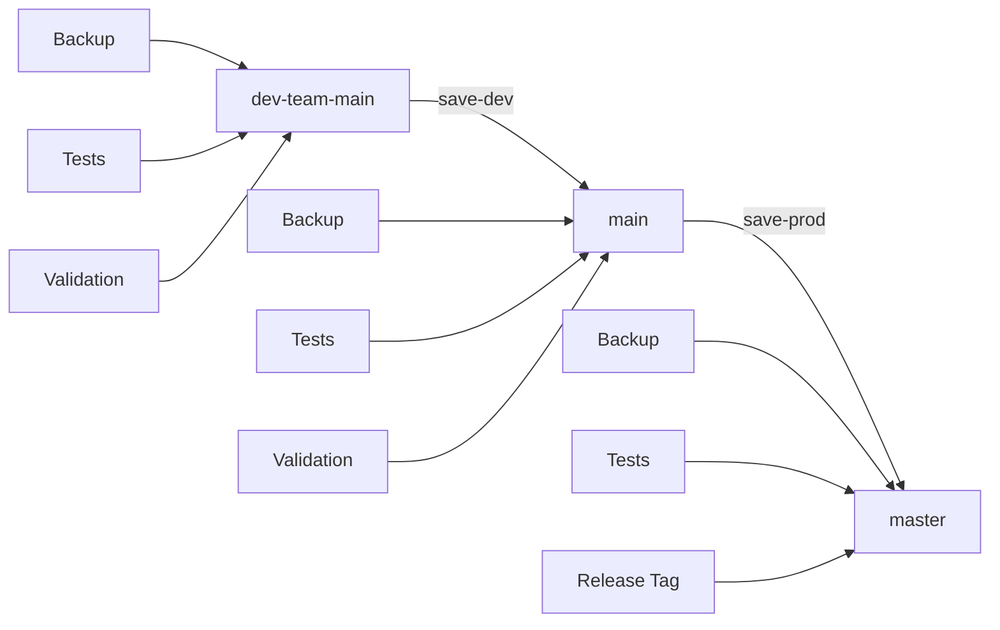

# 🚀 SynOS Git Save System - Complete Setup

## Overview

The SynOS Git Save System is a comprehensive, automated workflow management tool that eliminates git nightmares and provides safe, tested, and validated development operations. It replaces manual git commands with intelligent automation.

## 🎯 Quick Start Commands

| Command | Purpose | Keyboard Shortcut |
|---------|---------|------------------|
| `save-dev` | Save development work (dev-team-main → main) | `Ctrl+Shift+S` |
| `save-prod` | Save to production (main → master) | `Ctrl+Shift+Alt+S` |
| `git-check` | Repository status check | `Ctrl+Shift+G` |
| `save` | Interactive save system | `Ctrl+Shift+I` |

## 🏗️ Architecture



## 📋 Complete Workflow

### Development Save (`save-dev`)
1. **Pre-flight Checks**
   - Validates current branch (must be dev-team-main)
   - Creates timestamped backup
   - Stashes uncommitted changes safely

2. **Testing & Validation**
   - Runs comprehensive test suite
   - Validates development environment
   - Checks for critical TODOs/FIXMEs

3. **Git Operations**
   - Interactive commit with custom message
   - Safe push with force-with-lease
   - Merges dev-team-main into main

4. **Quality Assurance**
   - Re-runs tests on main branch
   - Validates merge integrity
   - Pushes main to remote

5. **Cleanup**
   - Returns to dev-team-main branch
   - Preserves working state

### Production Save (`save-prod`)
1. **Production Readiness**
   - Validates current branch (must be main)
   - Extended test suite execution
   - Environment compliance checks

2. **Release Process**
   - Merges main into master
   - Final production tests
   - Creates release tag with timestamp

3. **Deployment**
   - Pushes master to remote
   - Pushes release tags
   - Generates release notes

## 🔒 Safety Features

### Automatic Backups
- **Location**: `.git-backups/`
- **Format**: `backup_{branch}_{timestamp}.tar.gz`
- **Recovery**: Extract over repository directory

### Test Integration
- **Rust**: `cargo test --workspace`
- **Python**: `pytest tests/`
- **Makefile**: `make test`
- **Security**: Custom audit scripts
- **Environment**: Validation scripts

### Conflict Prevention
- **Force-with-lease**: Prevents accidental overwrites
- **Pre-merge validation**: Checks branch readiness
- **Automatic rollback**: On test failures
- **State preservation**: Stash/restore cycle

### Error Recovery
```bash
# View available backups
ls -la .git-backups/

# Restore from backup
tar -xzf .git-backups/backup_dev-team-main_2025-08-27_14-30-15.tar.gz

# Reset to backup tag
git reset --hard backup-pre-merge-20250827-143015
```

## 🛠️ Installation & Setup

### Local Setup
```bash
# Run the setup script
bash scripts/setup-dev-environment.sh

# Source the development environment
source .synos-profile

# Test the system
save-dev --help
```

### VS Code Integration
The system is automatically integrated into VS Code with:
- **Tasks**: Available in Command Palette
- **Keybindings**: Quick keyboard shortcuts
- **Terminal Integration**: Direct command access

### GitHub Codespaces
Automatically configured during codespace creation:
- Pre-installed during container setup
- Environment variables configured
- Aliases and shortcuts available
- Git hooks configured

## 📝 Configuration

### Environment Variables
```bash
export SYNOS_ROOT="/workspaces/Syn_OS"
export SYNOS_SCRIPTS="/workspaces/Syn_OS/scripts"
export SYNOS_LOGS="/workspaces/Syn_OS/logs"
export SYNOS_BACKUPS="/workspaces/Syn_OS/.git-backups"
```

### Git Configuration
```bash
# Safe directory for codespaces
git config --global --add safe.directory /workspaces/Syn_OS

# Local user configuration
git config --local user.name "Your Name"
git config --local user.email "your.email@domain.com"

# Git hooks
git config --local core.hooksPath "scripts/git-hooks"
```

## 🔍 Monitoring & Logs

### Log Files
- **Main Log**: `logs/git-save-system.log`
- **Rotation**: Manual cleanup recommended
- **Format**: Timestamped operation entries

### Status Commands
```bash
# Quick repository status
git-check

# Branch comparison
git log --graph --oneline --all

# Remote sync status
git fetch --dry-run
```

## 🚨 Troubleshooting

### Common Issues

#### ❌ "Not in a git repository"
**Solution**: Ensure you're in the SynOS repository directory
```bash
cd /workspaces/Syn_OS
git status
```

#### ❌ "Tests failed on main"
**Solution**: Check test output, fix issues, retry
```bash
# View test logs
tail -f logs/git-save-system.log

# Run tests manually
make test
cargo test --workspace
```

#### ❌ "Merge conflict detected"
**Solution**: System auto-aborts, resolve manually
```bash
# Check repository status
git-check

# Resolve conflicts manually
git status
git add .
git commit
```

#### ❌ "Remote may have been updated"
**Solution**: Fetch and review remote changes
```bash
git fetch
git log --oneline HEAD..origin/main
```

### Emergency Recovery

#### 🆘 Complete Reset
```bash
# Create emergency backup
git tag emergency-$(date +%s)

# Reset to known good state
git reset --hard origin/main

# Or restore from system backup
tar -xzf .git-backups/backup_main_$(date +%Y-%m-%d)*.tar.gz
```

#### 🆘 Stash Recovery
```bash
# List all stashes
git stash list

# Restore specific stash
git stash pop stash@{0}
```

## 📚 Best Practices

### Daily Workflow
1. **Morning**: `git-check` to review status
2. **Development**: Work on `dev-team-main`
3. **Progress**: `save-dev` regularly (every feature)
4. **Evening**: `git-check` for clean state

### Release Workflow
1. **Feature Complete**: All features on `dev-team-main`
2. **Integration**: Use `save-dev` to promote to `main`
3. **Testing**: Thorough testing on `main` branch
4. **Release**: Use `save-prod` to promote to `master`
5. **Verification**: `git-check` to confirm release

### Team Coordination
1. **Communication**: Announce before `save-prod`
2. **Coordination**: Check with team before major operations
3. **Documentation**: Update release notes
4. **Monitoring**: Watch for issues post-release

## 🔧 Advanced Usage

### Custom Test Integration
Add custom tests to `git-save-system.sh`:
```bash
# In run_tests() function
if [ -f "$REPO_ROOT/custom-tests.sh" ]; then
    bash "$REPO_ROOT/custom-tests.sh"
fi
```

### Custom Validation
Extend environment validation:
```bash
# In validate_environment() function
if ! command -v custom-tool > /dev/null; then
    return 1
fi
```

### Hook Customization
Modify git hooks in `scripts/git-hooks/`:
- `pre-commit`: Pre-commit validation
- `pre-push`: Push recommendations

## 🆘 Support

### Self-Service
1. **Check Logs**: `tail -f logs/git-save-system.log`
2. **Status Check**: `git-check`
3. **Documentation**: This README and `docs/GIT_SAVE_SYSTEM.md`

### Emergency Contacts
- **Repository Issues**: Check GitHub Issues
- **Environment Problems**: Run `validate-env`
- **Critical Failures**: Create emergency backup first

## 🎉 Success Indicators

### ✅ System Working Correctly
- Clean `git-check` output
- Successful `save-dev` operations
- All tests passing
- No merge conflicts
- Remote synchronization working

### ✅ Ready for Production
- All three branches synchronized
- Comprehensive tests passing
- Documentation updated
- Release notes prepared
- Team coordination complete

---

## 📖 Related Documentation

- **[Complete Technical Guide](docs/GIT_SAVE_SYSTEM.md)** - In-depth technical documentation
- **[VS Code Setup](docs/VSCODE_SETUP.md)** - Development environment configuration
- **[Security Guide](SECURITY.md)** - Security practices and audit procedures
- **[Contributing](CONTRIBUTING.md)** - Development and contribution guidelines

---

**🎯 Remember**: The save system is designed to prevent git nightmares. When in doubt, use the system instead of manual git commands!
